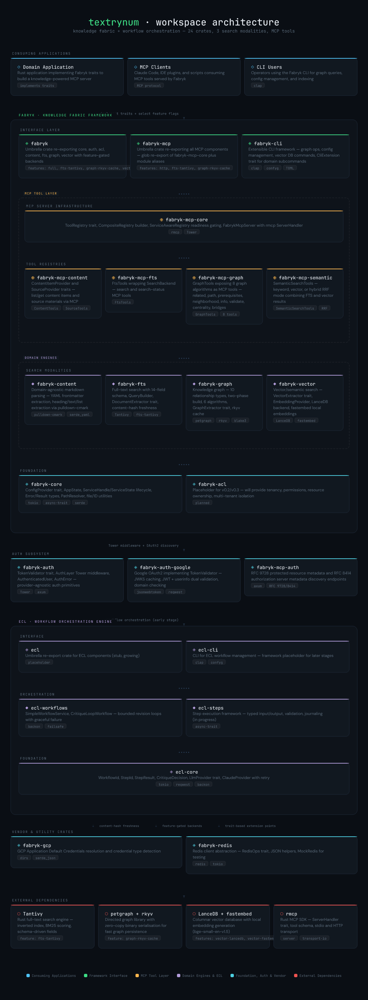

# Textrynum

[![][build-badge]][build]
[![][tag-badge]][tag]
[![][license badge]][license]

[![][logo]][logo-large]

*A workspace and tools for weaving knowledge into a hyper-connected, searchable fabric*

## What is Textrynum?

Textrynum is a workspace for building **knowledge systems**. It houses two complementary layers:

1. **[Fabryk](crates/fabryk/README.md)** — A modular knowledge fabric: ingest content, build knowledge graphs, index for full-text and semantic search, and serve it all via MCP tools. Production-ready, 24,000+ lines, 20 crates.

2. **[ECL](crates/ecl/README.md)** (Extract, Cogitate, Load) — A workflow orchestration engine for durable AI agent pipelines with feedback loops, validation, and managed serialism. Early stage, building on solid foundations.

---



*(generated with [Dendryform](https://github.com/oxur/dendryform))*

---

## Using Fabryk in Your Project

Fabryk is designed around two umbrella crates. Most projects need only one or
two `[dependencies]` lines:

```toml
[dependencies]
# Core knowledge fabric — content, graph, search, auth, acl
fabryk = { version = "0.2", features = ["full"] }

# MCP server tools — all tool suites + server infrastructure
fabryk-mcp = { version = "0.2", features = ["http"] }
```

### What each umbrella includes

**`fabryk`** provides the core library:

| Module | What it provides |
|--------|------------------|
| `fabryk::core` | Shared types, traits, error handling |
| `fabryk::auth` | Token validation, Tower middleware |
| `fabryk::acl` | Access control primitives |
| `fabryk::content` | Markdown parsing, frontmatter extraction |
| `fabryk::fts` | Full-text search (Tantivy backend) |
| `fabryk::graph` | Knowledge graph (petgraph) |
| `fabryk::vector` | Vector/semantic search (LanceDB) |

**`fabryk-mcp`** provides the MCP toolkit:

| Module | What it provides |
|--------|------------------|
| *(root)* | Server infrastructure, tool registry, health tools |
| `fabryk_mcp::auth` | OAuth2 discovery endpoints (RFC 9728/8414) |
| `fabryk_mcp::content` | Content and source MCP tools |
| `fabryk_mcp::fts` | Full-text search MCP tools |
| `fabryk_mcp::graph` | Graph query MCP tools |
| `fabryk_mcp::semantic` | Hybrid search MCP tools |

Vendor-specific crates are added separately as needed:

```toml
fabryk-auth-google = "0.2"  # Google OAuth2 / JWKS
fabryk-gcp = "0.2"          # GCP credential detection
```

See the [Fabryk README](crates/fabryk/README.md) for the full crate map and feature flags.

### HOWTOs

Step-by-step guides for common integration tasks with Fabryk MCP servers:

- [Connecting Fabryk MCP Servers to Claude Code](docs/howtos/mcp-with-claude-code.md) — Set up Claude Code to talk to your Fabryk MCP server over Streamable HTTP
- [MCP Async Startup Pattern](docs/howtos/mcp-async-startup.md) — Start MCP transport instantly while expensive services initialize in the background
- [MCP Health Endpoint How-To](docs/howtos/mcp-health.md) — Add a service-aware `/health` endpoint to your Fabryk MCP server
- [MCP Metadata & Discoverability How-To](docs/howtos/mcp-metadata.md) — Give AI agents rich metadata when connecting to your MCP server

---

## Project Status

**v0.2.0** — Fabryk is functional; ECL is in progress.

### Completed

- [x] Knowledge graph with traversal algorithms (fabryk-graph)
- [x] Full-text search with Tantivy backend (fabryk-fts)
- [x] Vector/semantic search with LanceDB (fabryk-vector)
- [x] Markdown content parsing and frontmatter extraction (fabryk-content)
- [x] MCP server infrastructure and tool suites (fabryk-mcp-*)
- [x] OAuth2 authentication with Google provider (fabryk-auth-*)
- [x] CLI framework with graph commands (fabryk-cli)
- [x] Configuration infrastructure with TOML support
- [x] Restructured crate hierarchy with two clean umbrella crates
- [x] CI/CD pipeline

### In Progress

- [ ] ECL workflow primitives
- [ ] Step abstraction layer with feedback loops
- [ ] LLM integration
- [ ] Connecting ECL workflows to Fabryk persistence

### Planned

- [ ] Additional MCP tool suites
- [ ] Example workflows
- [ ] Published crate documentation

---

## Getting Started

### Prerequisites

- Rust 1.85+

### Building

```bash
git clone https://github.com/oxur/textrynum
cd textrynum
cargo build
```

### Testing

```bash
cargo test --workspace --all-features
```

---

## Contributing

We're not yet accepting external contributions, but will open the project once the core architecture stabilizes.

---

## License

Apache-2.0

---

[//]: ---Named-Links---

[logo]: assets/images/logo/v1-y250.png
[logo-large]: assets/images/logo/v1.png
[build]: https://github.com/oxur/textrynum/actions/workflows/cicd.yml
[build-badge]: https://github.com/oxur/textrynum/actions/workflows/cicd.yml/badge.svg
[tag-badge]: https://img.shields.io/github/tag/oxur/textrynum.svg
[tag]: https://github.com/oxur/textrynum/tags
[license]: LICENSE-APACHE
[license badge]: https://img.shields.io/badge/License-Apache%202.0%2FMIT-blue.svg
