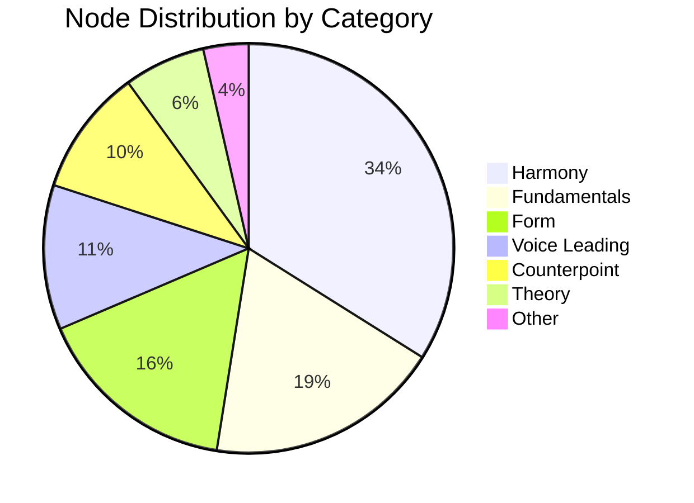
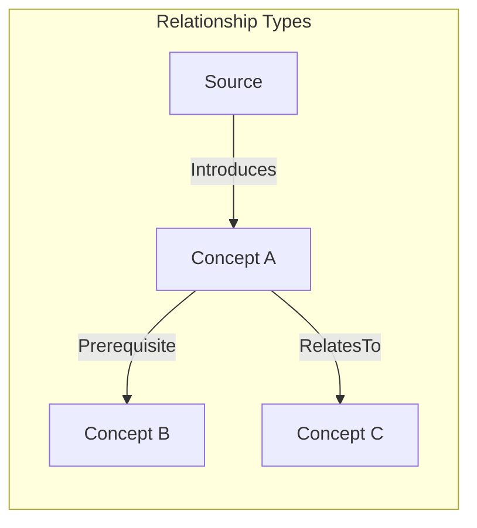
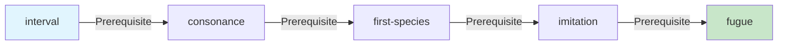
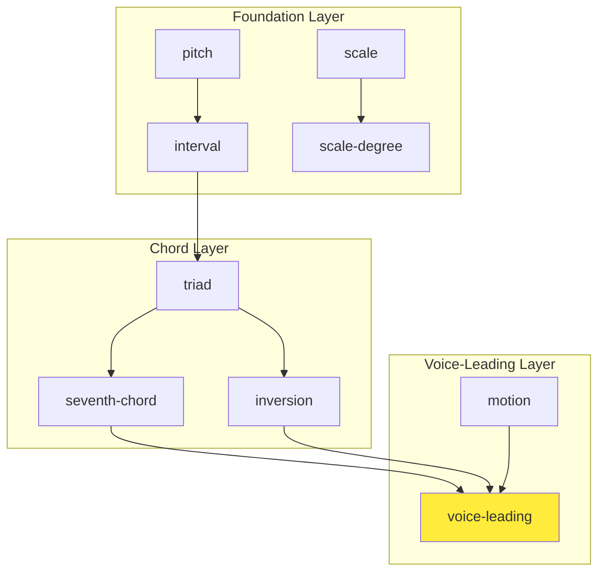
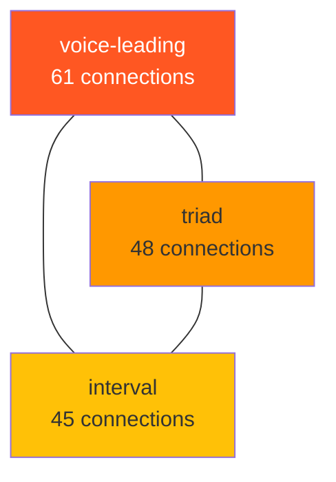
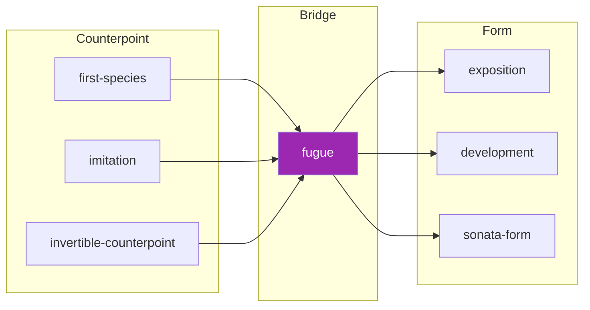
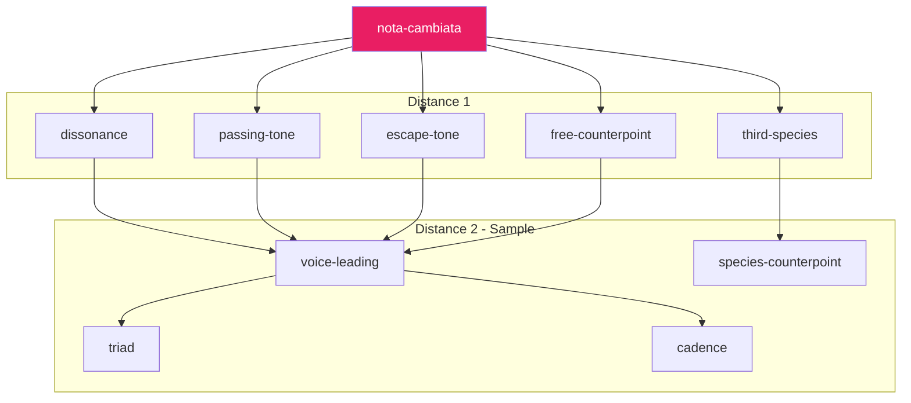
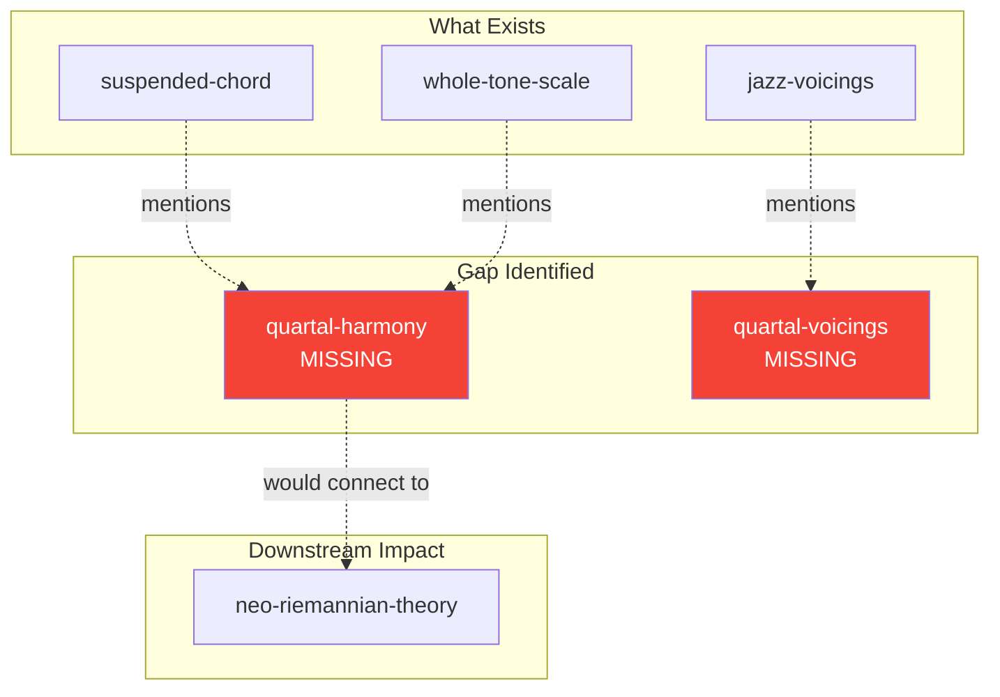
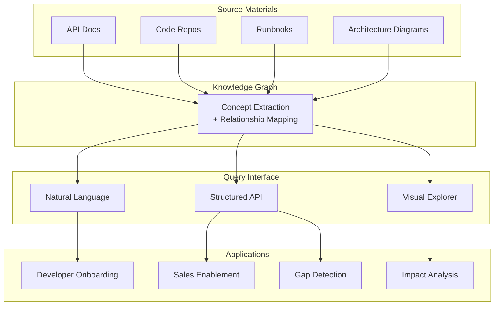

# Knowledge Graph Query Capabilities Demo
## A Conceptual Tour with Music Theory Examples & Business Applications

**Version:** 1.0  
**Date:** January 2026  
**Audience:** Technical & Business Leadership

---

## Executive Summary

This document demonstrates a **knowledge graph system** designed to organize, connect, and query complex conceptual domains. Using music theory as our working example, we showcase capabilities directly applicable to:

- **Developer Documentation** — Query relationships between APIs, libraries, and code patterns
- **Multi-Repository Code Intelligence** — Understand dependencies and architectural connections across codebases
- **Solutions Engineering** — Navigate product features, integration patterns, and customer requirements
- **Sales Enablement** — Surface relevant case studies, competitive differentiators, and technical capabilities

> **The Core Insight:** Knowledge isn't flat—it's a network. Traditional search finds *documents*. Graph queries find *understanding*.

---

## Table of Contents

1. [Graph Overview & Statistics](#1-graph-overview--statistics)
2. [Pathfinding: From A to B](#2-pathfinding-from-a-to-b)
3. [Prerequisites: Learning Dependencies](#3-prerequisites-learning-dependencies)
4. [Centrality Analysis: Finding Hub Concepts](#4-centrality-analysis-finding-hub-concepts)
5. [Bridge Concepts: Connecting Domains](#5-bridge-concepts-connecting-domains)
6. [Neighborhood Exploration: Local Context](#6-neighborhood-exploration-local-context)
7. [Gap Analysis: What's Missing?](#7-gap-analysis-whats-missing)
8. [Business Applications Summary](#8-business-applications-summary)

---

## 1. Graph Overview & Statistics

### What We Built

The knowledge graph indexes **293 nodes** (280 concepts + 13 source materials) connected by **1,619 edges** representing various relationship types.



### Relationship Types

| Relationship | Count | Description |
|-------------|-------|-------------|
| `Prerequisite` | 847 | A must be understood before B |
| `RelatesTo` | 524 | Conceptual connection |
| `Introduces` | 248 | Source material teaches concept |



---

> ### 💼 Business Application: Documentation Intelligence
> 
> **Scenario:** Index your API documentation, SDK guides, and code samples.
> 
> | Music Theory | Developer Docs Equivalent |
> |-------------|---------------------------|
> | 280 concept cards | API endpoints, SDK methods, configuration options |
> | 13 source materials | Official docs, tutorials, migration guides |
> | `Prerequisite` edges | "Requires authentication setup before calling" |
> | `RelatesTo` edges | "See also: rate limiting, pagination" |
> | `Introduces` edges | "Covered in: Getting Started Guide" |
> 
> **Value:** Instead of searching docs, developers ask: *"What do I need to understand before implementing webhooks?"* and get a structured learning path.

---

## 2. Pathfinding: From A to B

### The Query

**Question:** *How does a basic concept like "interval" connect to an advanced topic like "fugue"?*

### The Result

```
Path found with 5 steps:
interval → consonance → first-species → imitation → fugue
```



### What This Reveals

The path shows the **pedagogical journey** from fundamentals to mastery:
1. **Interval** — Basic pitch distance measurement
2. **Consonance** — Which intervals sound stable together
3. **First-species counterpoint** — Simple two-voice writing
4. **Imitation** — Melodic echoing between voices
5. **Fugue** — Complex multi-voice imitative form

---

> ### 💼 Business Application: Customer Journey Mapping
> 
> **Scenario:** Map the path from a prospect's current state to full platform adoption.
> 
> ```mermaid
> graph LR
>     A[free-trial] -->|Prerequisite| B[basic-auth]
>     B -->|Prerequisite| C[first-integration]
>     C -->|Prerequisite| D[production-deployment]
>     D -->|Prerequisite| E[enterprise-features]
>     
>     style A fill:#e1f5fe
>     style E fill:#c8e6c9
> ```
> 
> **Use Cases:**
> - **Sales:** "To get to enterprise features, they need production deployment first. Have they completed that?"
> - **Solutions Engineering:** "Before we demo SSO, let's confirm their basic auth is working."
> - **Onboarding:** Auto-generate learning paths based on customer goals.

---

## 3. Prerequisites: Learning Dependencies

### The Query

**Question:** *What are ALL the prerequisites for understanding "voice-leading"?*

### The Result

**67 dependencies** organized in topological (learning) order:



### Complete Prerequisite Chain (Sample)

| Layer | Concepts |
|-------|----------|
| 1 (Fundamentals) | pitch, note, staff, clef |
| 2 (Pitch Relations) | interval, half-step, whole-step |
| 3 (Scales) | major-scale, minor-scale, mode |
| 4 (Chords) | triad, seventh-chord, inversion |
| 5 (Motion) | contrary-motion, parallel-motion, oblique-motion |
| 6 (Target) | **voice-leading** |

---

> ### 💼 Business Application: Technical Skill Requirements
> 
> **Scenario:** Determine all prerequisites for a complex feature implementation.
> 
> | Music Theory | Code Repository Equivalent |
> |-------------|---------------------------|
> | "voice-leading" | "microservices-deployment" |
> | 67 prerequisites | All required: Docker, K8s, service mesh, auth, logging... |
> | Topological ordering | Correct learning sequence for new engineers |
> 
> **Query:** `get_prerequisites("microservices-deployment", depth=5)`
> 
> **Returns:** Ordered list starting from basics (git, containers) through intermediate (Docker, CI/CD) to advanced (K8s, Helm, service discovery).
> 
> **Value for Solutions Engineering:**
> - Instant skill-gap analysis for customer technical teams
> - Auto-generated implementation roadmaps
> - Realistic timeline estimation based on prerequisite depth

---

## 4. Centrality Analysis: Finding Hub Concepts

### The Query

**Question:** *Which concepts are the most connected "hubs" in the knowledge graph?*

### The Result

| Rank | Concept | Connections | Category |
|------|---------|-------------|----------|
| 1 | **voice-leading** | 61 | voice-leading |
| 2 | triad | 48 | fundamentals |
| 3 | interval | 45 | fundamentals |
| 4 | scale-degree | 42 | fundamentals |
| 5 | seventh-chord | 38 | fundamentals |
| 6 | cadence | 35 | harmony |
| 7 | modulation | 33 | harmony |



### Why This Matters

**Voice-leading** emerges as the dominant hub because it's the practical application layer—where all theoretical knowledge converges into actual music-making. It connects:
- Upward to complex topics (counterpoint, chromatic harmony)
- Downward to fundamentals (intervals, chords)
- Laterally to parallel concepts (harmonic rhythm, texture)

---

> ### 💼 Business Application: Identifying Core Competencies
> 
> **Scenario:** Discover which concepts/APIs/features are most critical to your platform.
> 
> ```mermaid
> graph TD
>     AUTH[authentication<br/>89 connections]
>     API[api-gateway<br/>67 connections]
>     DATA[data-model<br/>54 connections]
>     
>     AUTH --- API
>     AUTH --- DATA
>     API --- DATA
>     
>     style AUTH fill:#ff5722,color:#fff
>     style API fill:#ff9800
>     style DATA fill:#ffc107
> ```
> 
> **Use Cases:**
> - **Architecture Review:** High-centrality components need the most robust design
> - **Sales Positioning:** "Our authentication layer integrates with 89 other capabilities"
> - **Documentation Priority:** Most-connected concepts need the best documentation
> - **Risk Assessment:** Breaking changes to hub concepts have the widest impact

---

## 5. Bridge Concepts: Connecting Domains

### The Query

**Question:** *What concepts connect "counterpoint" to "form"?*

These are concepts that exist in one category but have strong relationships to another—they're the bridges between knowledge domains.

### The Result

| Bridge Concept | Links to Counterpoint | Links to Form |
|----------------|----------------------|---------------|
| **fugue** | 12 connections | 8 connections |
| invertible-counterpoint | 6 connections | 4 connections |
| imitation | 5 connections | 3 connections |



### Why Fugue is the Bridge

Fugue is fascinating because it lives in **both worlds**:
- As **counterpoint**: It's the culmination of voice-leading and imitative techniques
- As **form**: It's a structural archetype with exposition, episodes, and development

---

> ### 💼 Business Application: Cross-Selling & Integration Discovery
> 
> **Scenario:** Find features that naturally bridge between product areas.
> 
> | Music Theory | Product Feature Equivalent |
> |-------------|---------------------------|
> | "counterpoint" category | Authentication product line |
> | "form" category | Analytics product line |
> | "fugue" bridge | **Audit Logging** — spans both security AND analytics |
> 
> **Query:** `find_bridge_concepts("security", "analytics")`
> 
> **Returns:** audit-logs, user-activity-tracking, compliance-reporting
> 
> **Use Cases:**
> - **Sales:** "Customer uses our auth—audit logging bridges them to our analytics suite"
> - **Product:** Identify natural integration points between teams
> - **Solutions Engineering:** Design architectures that leverage bridge capabilities

---

## 6. Neighborhood Exploration: Local Context

### The Query

**Question:** *What's the local context around an obscure concept like "nota cambiata"?*

(Nota cambiata is a specific Renaissance melodic figure—deliberately chosen as an obscure test case.)

### The Result

With just a **2-hop radius**, we reached **280 of 293 nodes** (95.5% of the entire graph)!



### What This Reveals

The knowledge graph exhibits **"small world" properties**—even the most obscure concept is only 2 hops from nearly everything else. This means:
- The graph is well-connected (no isolated islands)
- Pedagogical paths exist between any two concepts
- The indexing captured genuine conceptual relationships

---

> ### 💼 Business Application: Impact Analysis
> 
> **Scenario:** Understand the blast radius of changes to any component.
> 
> **Query:** `get_concept_neighborhood("payment-processor", radius=2)`
> 
> **Returns:**
> ```
> Distance 1: checkout-flow, refund-service, subscription-billing
> Distance 2: user-accounts, analytics, compliance, fraud-detection...
> Total reach: 45 of 120 services (37.5% of architecture)
> ```
> 
> **Use Cases:**
> - **Engineering:** "Changing payment-processor affects 45 services within 2 hops"
> - **QA:** Prioritize regression testing based on neighborhood size
> - **Architecture Review:** Identify tightly-coupled vs. loosely-coupled components

---

## 7. Gap Analysis: What's Missing?

### The Query

**Question:** *Do we have dedicated concepts for quartal/quintal harmony?*

### The Result

**No dedicated nodes found.** The search revealed *references* to quartal harmony inside other cards, but no standalone concept cards for:
- `quartal-harmony`
- `quintal-harmony`  
- `non-tertian-harmony`

### What This Reveals



The gap analysis reveals that while we mention quartal concepts peripherally, we lack:
1. Dedicated teaching material
2. Proper graph connectivity
3. Clear prerequisite relationships

---

> ### 💼 Business Application: Documentation Coverage Analysis
> 
> **Scenario:** Identify gaps in your documentation or feature coverage.
> 
> **Query:** `search_concepts("kubernetes deployment")` + cross-reference with product features
> 
> **Might Reveal:**
> - Feature exists but no documentation
> - Documentation references features that don't exist yet
> - Orphaned concepts with no prerequisite paths
> 
> **Use Cases:**
> - **Documentation Team:** Prioritize based on reference frequency without dedicated coverage
> - **Product Management:** Features mentioned in docs but not yet built = customer demand signals
> - **Sales:** Avoid promising capabilities that have no documented path

---

## 8. Business Applications Summary

### Query Capabilities → Business Value

| Graph Capability | Sales | Solutions Engineering | Product | Engineering |
|-----------------|-------|----------------------|---------|-------------|
| **Pathfinding** | Customer journey mapping | Implementation roadmaps | Feature dependency analysis | Migration planning |
| **Prerequisites** | Skill-gap assessment | Training requirements | Onboarding sequences | Tech debt prioritization |
| **Centrality** | Value prop prioritization | Architecture review | Documentation priority | Risk assessment |
| **Bridge Concepts** | Cross-sell identification | Integration design | Product bundling | API surface design |
| **Neighborhoods** | Impact communication | Blast radius analysis | Release planning | Regression scoping |
| **Gap Analysis** | Opportunity identification | Coverage assessment | Roadmap gaps | Technical debt |

### Implementation Domains



---

## Appendix: Available Query Tools

| Tool | Purpose | Example Use |
|------|---------|-------------|
| `graph_status` | Overall statistics | "How big is our knowledge graph?" |
| `graph_stats` | Detailed breakdown | "Distribution by category?" |
| `get_concept` | Single concept details | "Tell me about OAuth" |
| `search_concepts` | Full-text search | "Find anything about rate limiting" |
| `get_prerequisites` | Dependency chain | "What must I learn before X?" |
| `get_dependents` | Reverse dependencies | "What breaks if I change X?" |
| `find_concept_path` | A→B navigation | "How does auth connect to billing?" |
| `get_central_concepts` | Hub identification | "What are our core concepts?" |
| `find_bridge_concepts` | Cross-domain links | "What connects security to analytics?" |
| `get_concept_neighborhood` | Local context | "What's near this concept?" |
| `get_related_concepts` | Direct relationships | "What's directly connected?" |
| `list_sources` | Source materials | "What documentation is indexed?" |
| `get_source_coverage` | Source→concepts | "What does this guide teach?" |

---

## Next Steps

1. **Pilot Domain Selection** — Choose a bounded documentation set for initial indexing
2. **Concept Extraction** — Define templates for your domain's concept cards
3. **Relationship Mapping** — Establish relationship types relevant to your use case
4. **Query Interface** — Determine access patterns (API, chat, visual)
5. **Integration Points** — Connect to existing tools (Slack, IDE, CRM)

---

*Document prepared from live exploration session, January 2026*
